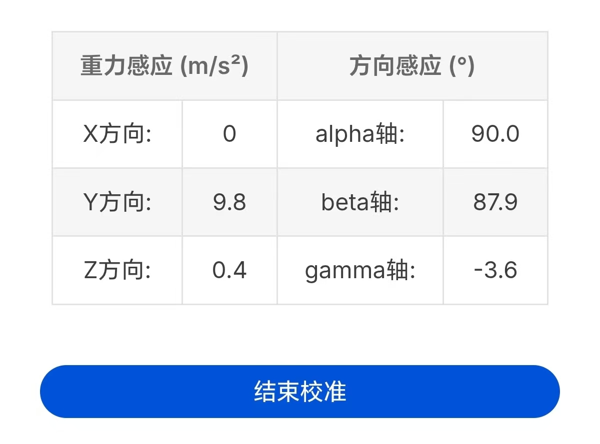
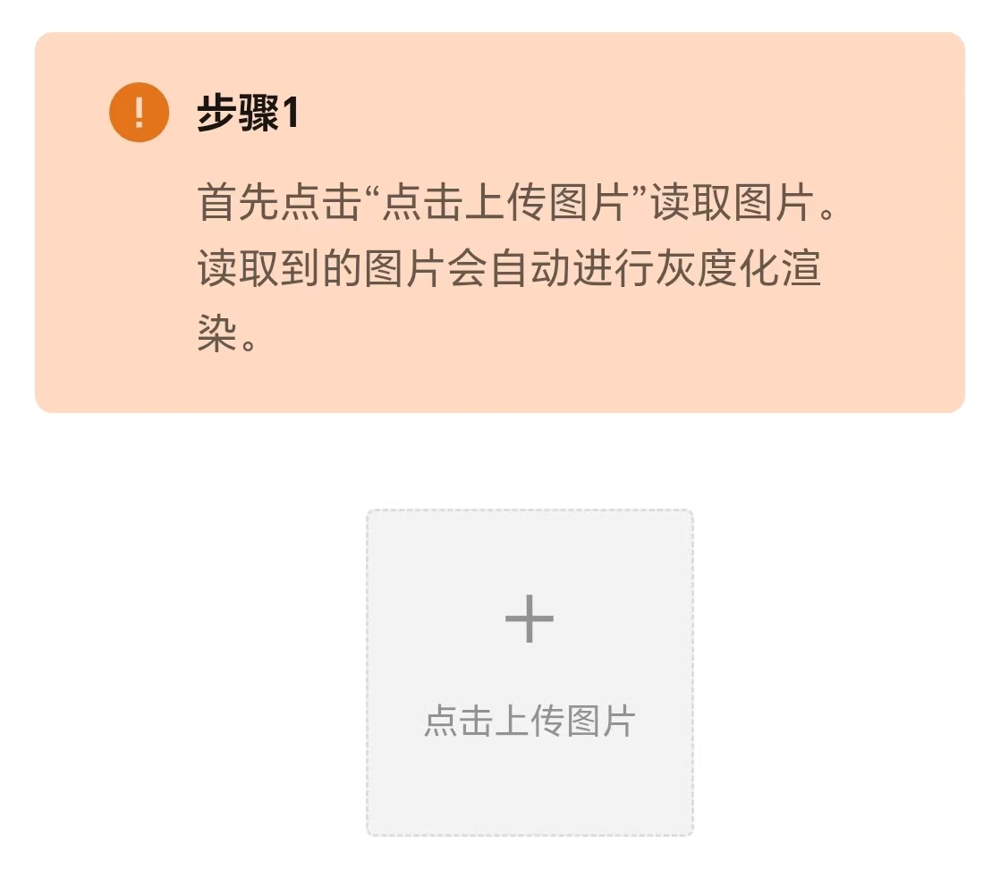
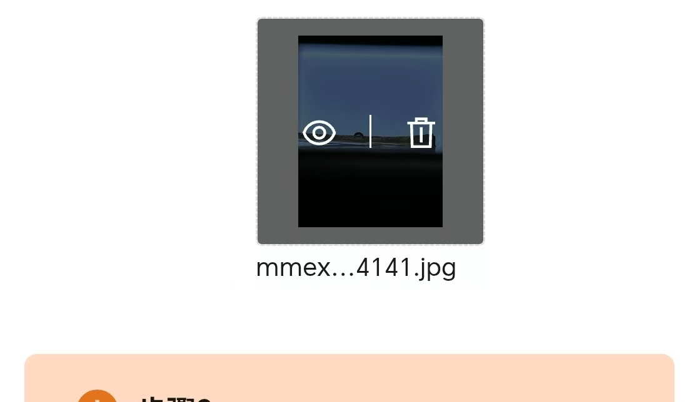
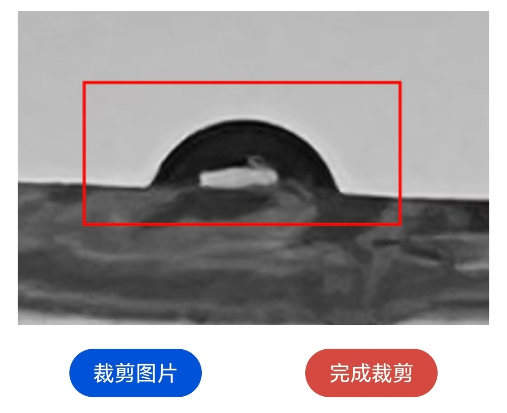
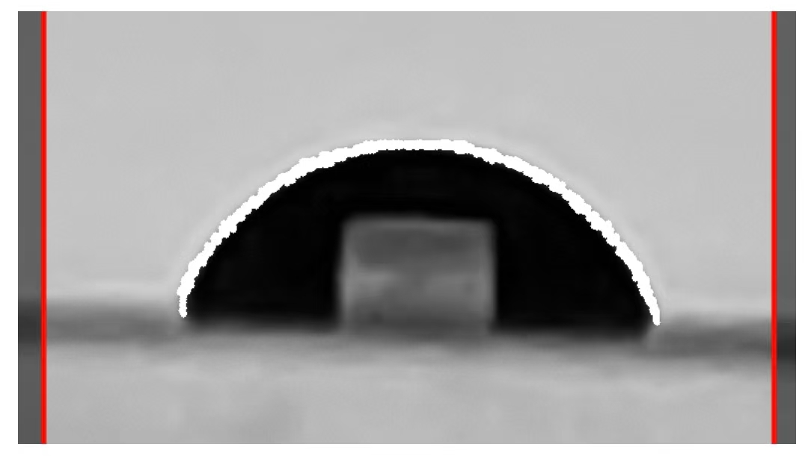
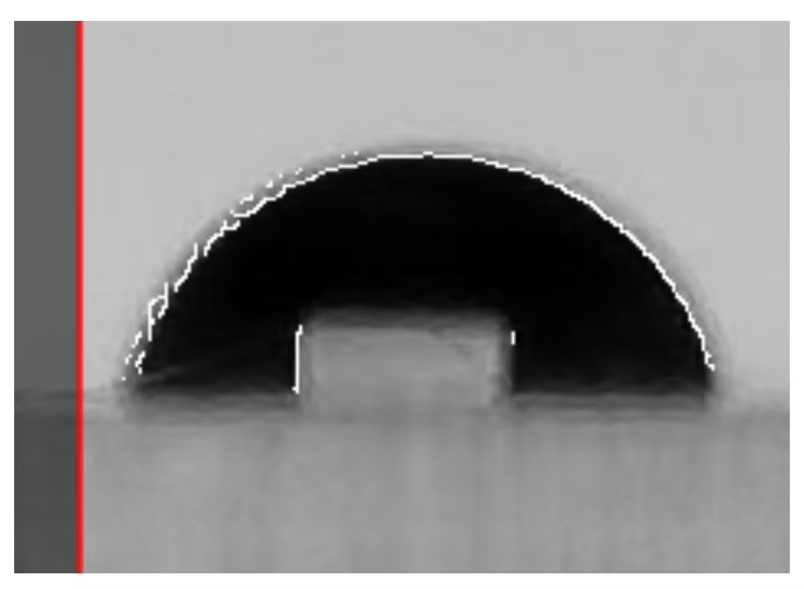
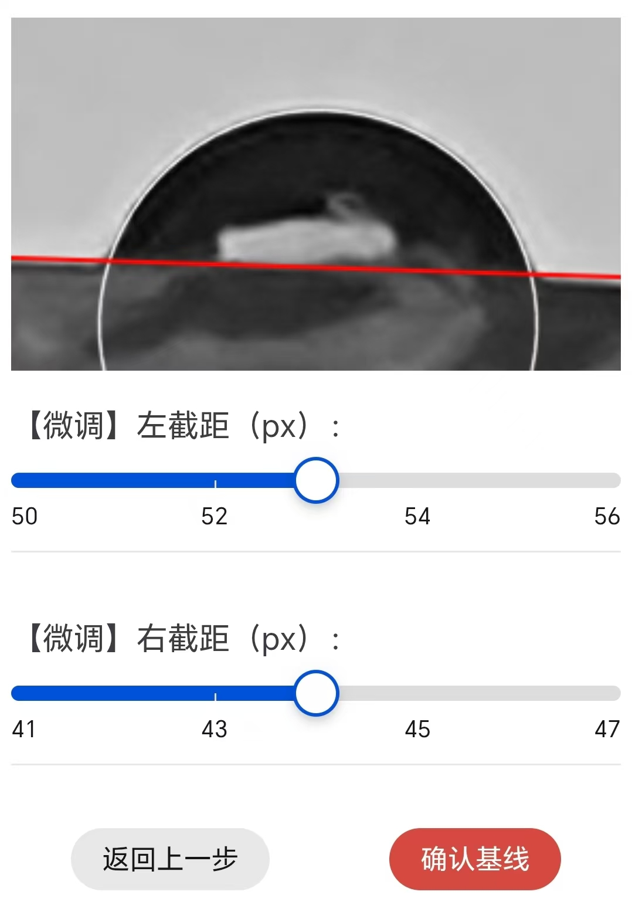
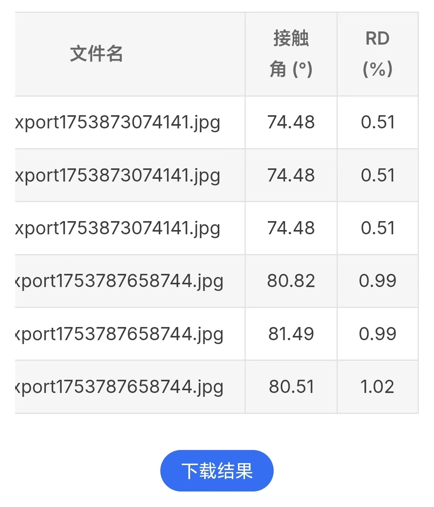

# 接触角

> [!warning] 本业务包含2个WebApp：
> 
> 1.  [**设备垂直校准**](vertical-calibration.md)。可满足接触角测量前，手机需进行的垂直校准操作需求。
> 
> 2.  [**液滴照片处理**](drop-pic-process.md)。可满足接触角测量后，需对图片进行的各类处理需求，可获得最终的接触角数据。

[[toc]]

## 1.  接触角概述

液体在固体上的表面张力性质一般以固体的表面润湿性能进行描述，最为容易测量并定量的润湿性能参数即为**接触角**：接触角（contact angel）是液滴在固体表面处于平衡状态时，气-液界面与固-液界面的夹角（$θ$），如图1所示：

<MyPicHead>图1  接触角的定义图</MyPicHead>

图中，$σ_\mathrm{sg}$ 为固-气界面张力，$σ_\mathrm{lg}$ 为液-气界面张力，$σ_\mathrm{sl}$ 为固-液界面张力，$θ$ 即为接触角。很显然地，当液滴处于平衡状态时，满足式(1)：

$$ \tag{1}
  σ_\mathrm{lg} \cdot \cos{θ} + σ_\mathrm{sl} = σ_\mathrm{sg}
$$

式(1)即为杨氏公式（Young equation），也称润湿公式。进一步地，可得：

$$ \tag{2}
  \cos{θ} = \frac{σ_\mathrm{sg} - σ_\mathrm{sl}}{σ_\mathrm{lg}} 
$$

即当0° < $θ$ < 90°时，1 > $\cos{θ}$ > 0，则 $σ_\mathrm{SV}$ > $σ_\mathrm{SL}$，固体表面倾向于被液体润湿；

当90° < $θ$ < 180°时，0 > $\cos{θ}$ > -1，则 $σ_\mathrm{SV}$ < $σ_\mathrm{SL}$，固体表面倾向于不被液体润湿。

因此，在讨论液体对固体表面的润湿性时，一般将90°接触角作为是否润湿的标准：$θ$ > 90°为不润湿，$θ$ < 90°为润湿。

由于接触角测量的普适性与易用性，可以说，接触角已成为表征液体在固体上的表面张力性质的最为重要的参数之一，接触角测量操作也已成为表面润湿性能表征的事实标准之一。同时，通过接触角的测量，也可计算得到表面活性剂的临界胶束浓度数据。

## 2.  设备垂直校准

[**设备垂直校准功能链接**](vertical-calibration.md)

本功能较为简单，点击“调用传感器”后，即可利用手机自身的传感器，对手机进行必要的垂直校准操作。

绝大多数手机同时拥有 **重力感应** 与 **方向感应** 两种实现，因此本功能也对此两种实现的优劣异同进行了简单说明，并提供了操作建议。典型的说明及建议内容如下：

在使用本功能是，典型的数据信息界面如下：

当校准完毕后，可返回上一页，或跳转至其他页面以退出垂直校准。也可点击“结束校准”按钮以暂时退出校准。

## 3.  液滴照片处理

[**液滴照片处理功能链接**](drop-pic-process.md)

液滴照片处理功能主要分为以下几个步骤：

### 3.1 读取图片/上传图片

点击读取图片后，软件将自动对图片进行灰度化处理。并绘制出灰度图，以便下一步操作。

> [!info] Tips：
> 
> 上传图片后，可点击此按钮重新上传图片（如下图）。
> 
> 因此可实现连续处理多张图片而不用刷新页面。

### 3.2 裁剪图片为合适的尺寸

此步骤主要通过点击灰度图以完成。具体操作功能有：短按控制裁剪区的边框扩大/缩小；长按清空已有选框。

> [!info] Tips：
> 
> 可以**反复多次**点击“裁剪”按钮，建议少量多次裁剪照片，可极大简化裁剪工作。

较为典型的裁剪尺寸建议如下图所示：

得到较为理想的裁剪结果后，或框选出较为理想的待裁剪红框，点击“完成裁剪”按钮结束裁剪，并进入下一步。

### 3.3 寻找液滴的最佳轮廓

此步骤主要通过调节滑轨以实时修改轮廓寻找算法的参数，并实时查看轮廓效果。

本应用提供了2个算法（Canny算法与阈值化方法）以寻找轮廓，算法切换开关位于图片上方。在切换至具体算法时，会出现关于此算法的简单说明，如下图所示：

两种算法中，Canny算法有2个参数（因此在图片下方提供了2个滑轨），而阈值化方法有1个参数（即在图片下方提供了1个滑轨）。为更方面的对参数进行微调，本软件提供了“切换细调/切换粗调”按钮，切换后可细化/粗化滑轨的范围值。

调节滑轨可实时查看轮廓效果（灰度图叠加轮廓线）。理想的轮廓效果如下图：

大多数情况下，所拍摄的液滴中部会存在一个与光源形状相近的明亮区域，这是由于液滴表面将后方光源的形状透过液滴投射到了图像中心导致。这一光学现象在强光源和高反差情况下极为普遍。而此情况下的液滴中部明亮区域将不可避免的被轮廓查找算法误识别为轮廓。此时，**应尽可能调节滑轨，使液滴中部误识别轮廓线尽可能少。**此情况下较为推荐的典型轮廓识别效果如下图所示：

为解决液滴中部的误识别轮廓问题，本软件自主设计了迭代过滤算法：当中部轮廓线显著少于外部真实轮廓线时，本软件的迭代过滤算法将自动过滤掉中部的轮廓线。因此，通过合理调节滑轨，使真实轮廓线尽可能多、中部误识别轮廓线尽可能少。即可实现较好的轮廓识别效果。

除此以外，当固体基底透光率较差时，固体基底的轮廓也可能被误识别为液滴轮廓。此时，可点击图片左部或右部设置图片遮罩，将固体基底上误识别的轮廓线罩住。被遮罩的轮廓点将不会参与后续拟合。**此步骤不用追求极致精确，因为在本软件的迭代过滤算法加持下，少量未被遮罩的误识别固体基底线将被自动过滤。**典型的此类情况如下图所示：

> [!info] Tips：
> 
> 尽可能调节滑轨，使液滴中部误识别轮廓线尽可能少。
> 
> 调节左右遮罩区，将固体基底上误识别的轮廓线罩住（粗略罩住大部分即可）。

完成轮廓寻找后，可点击“确认轮廓”按钮，实现轮廓的迭代与拟合。**若拟合效果不佳，可随时点击“返回上一步”重新寻找轮廓。**

### 3.4 寻找基线

此步骤将在步骤3所得拟合椭圆轮廓线的基础上，寻找液滴的基线。

典型的操作功能及实现效果如下图：

直接点击图片可实现基线的粗调：点击图片左侧/右侧可粗调基线的左/右截距；点击图片中部可上/下平移基线。

在粗调的基础上，滑动图片下方的滑轨，可对基线的左/右截距进行细调。

在确定好基线的截距后，点击“确认基线”按钮，软件将自动计算接触角。

### 3.5 计算接触角

软件将自动计算轮廓拟合的决定系数，左、右接触角的数值，接触角平均值，左、右接触角的相对偏差（Relative Deviation, RD）。

计算完成后，本软件将以弹窗通知的形式将接触角平均值数据告知用户，典型的弹窗通知如下图所示：

除弹窗通知外，文件名、触角平均值、相对偏差值将以表格形式展示于页面下部：

表格下方的“下载”按钮，可下载包含所有数据的excel表格文件。

## 4.  其它内容扩展

### 4.1 ImageJ

ImageJ是一款开源的图像处理软件，由美国国家卫生研究院（NIH）维护。该软件被广泛应用于生物学、医学、物理学等领域的图像分析。可以说，ImageJ是科研界最常用的图像处理软件，没有之一。

本业务即借鉴了ImageJ的接触角插件，完成了接触角图片处理软件的编写。

除此以外，ImageJ还拥有图像滤波、形态学操作、边缘检测、区域提取等诸多强大功能，可实现细胞计数和测量、蛋白质凝胶分析、组织切片的定量分析、电子显微镜图像处理等诸多业务需求，为科研工作者提供了极大的便利。

ImageJ官网链接：[https://imagej.net/ij/index.html](https://imagej.net/ij/index.html)

<!--
  逻辑层
 -->

<!--
  样式层
 -->

